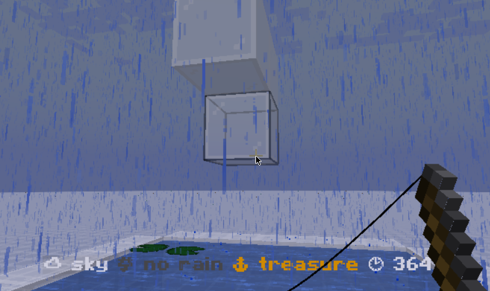

# Carpet Genie

*[add badges]*

Carpet Genie is just another [Carpet mod](https://github.com/gnembon/fabric-carpet) with a few more settings :)

## Acknowledgement

- [@gnembon](https://github.com/gnembon)'s original [Carpet mod](https://github.com/gnembon/fabric-carpet) that started it all.
- [@jsorrell](https://github.com/jsorrell)'s [Carpet Sky Additions](https://github.com/jsorrell/CarpetSkyAdditions) in which my entire project structure is based upon.
- The [Fabric wiki](https://fabricmc.net/wiki/start) for the tutorials, references, and mod template.

## Installation

*[add installation guide]*

## Features

<!---
### Return of the Witch

Provides options to make witch farm more viable to combat the nerf from decreased world bottom and overwhelmingly more productive raid farms.

#### [WIP] `spawnFromFloorHeightmap`

Mob spawning algorithm randomly selects the y coordinate from the floor to surface + 1 instead of from world bottom to surface + 1.

- Type: `Boolean`
- Default value: `false`
- Allowed values: `true`, `false`
- Categories: `FEATURE`, `SPAWNING`

I.e. selects between bottom-most block and top-most block instead of lowest y and top-most block.

E.g. spawning platform at y -64 will have the same rate as a spawning platform at any y level in a void condition.

Affects theoretical rates for all structure spawns that are fixed above the world bottom (witch, fortress mobs, guardian, etc.).

#### [WIP] `spawnHeightmapIgnoresBedrock`

Mob spawning algorithm heightmap ignores bedrock.

- Type: `Boolean`
- Default value: `false`
- Allowed values: `true`, `false`
- Categories: `FEATURE`, `SPAWNING`

E.g. nether perimeter without the bedrock ceiling removed will have the same rate as if it were removed.

Affects both the surface and floor heightmap.

#### [WIP] `witchSwampHutMaxGroupSize`

Sets the maximum pack spawning group size for witches in swamp hut.

- Type: `Integer`
- Default value: `1`
- Allowed values: `1`, `2`, `3`, `4`
- Categories: `FEATURE`, `SPAWNING`

Does not affect the maximum group size for witches spawning in other environments (e.g. general mob spawning in the overworld).

### Anvil Mechanics

Decouples the enchantment display order from the maximum level cap while still keeping an incentive to enchant optimally anvil-use-wise.

#### [WIP] `enchantmentCostsCountTowardsLevelCap`

Enchantment costs still exist but does not contribute to the maximum level cap when using an anvil.

- Type: `Boolean`
- Default value: `true`
- Allowed values: `true`, `false`
- Categories: `FEATURE`, `SURVIVAL`

E.g. if we represent enchanting operations as a binary tree where a node is a result of combining the left (target) and right (sacrifice) children, we are still encouraged to keep the tree height small due to the level cap. But we are free to re-arrange the leaf nodes without the enchantment cost changes contributing to the level cap.

#### [WIP] `upgradingEnchantmentsDoesNotIncreaseAnvilUse`

Anvil operations that only results in upgrading the enchantment levels on the target do not increase the anvil use.

- Type: `Boolean`
- Default value: `false`
- Allowed values: `true`, `false`
- Categories: `FEATURE`, `SURVIVAL`

E.g. adding a 0 anvil use unbreaking 2 book (sacrifice) to a 1 anvil use mending and unbreaking 2 book (target) results in 1 anvil use (instead of 2) mending and unbreaking 3 book since it only upgrades.

-->

### Debugging

#### `debugFishing`

Shows whether the bobber has access to sky and rain, qualifies for treasure loot, and the remaining ticks until there's a fish.

- Type: `Boolean`
- Default value: `false`
- Allowed values: `true`, `false`
- Categories: `DEBUG`, `FISHING`

This example demonstrates that both air and lily pads are fine, and that access to rain can be blocked when we still have access to sky.

## Style & Philosophy

### Carpet

Gnembon [envisioned](https://www.youtube.com/watch?v=Lt-ooRGpLz4) his Carpet mod to
give more control to the game,
facilitate understanding of various mechanics,
address bugs/inefficiencies,
and provide alternatives to missing/lacking issues.
All while preserving the vanilla feel and making minimal/non-destructive changes.
The world should still run with/without any of the carpet rules.

This mod is thus made with this philosophy in mind,
and anything that requires more drastic changes to the game will be separated into different mods instead.

### Renewability

*[add notes on from-one-mob-spawnable-block goal]*

### Naming Convention

There are a lot of good ideas when it comes to alternative designs/options
such as how sand should be renewed (drops from husks, anvil crushing cobblestone, eroding from corals, etc.).
Thus we should name the settings specific enough that it shouldn't result in a naming conflict despite the mod namespace.

E.g. prefer [`huskDropsSand`](https://github.com/MultiCoreNetwork/carpet-redcraft-addons?tab=readme-ov-file#huskDropsSand) and [`anvilCrushStone`](https://gitlab.com/Ma_124/mc-anvil-crush/#anvilcrushstone) to the more generic [`renewableSand`](https://github.com/gnembon/carpet-extra?tab=readme-ov-file#renewablesand).

### Granularity

Some settings are more or less granular than their desired use case. The [`mobGriefing`](https://minecraft.wiki/w/Mobgriefing) game rule comes to mind; we may want to disable destructive ones such as from creepers and endermen, while still allowing villagers to pick up food.

Either provide a list or allow overlapping rules where more specific settings take precedence.
